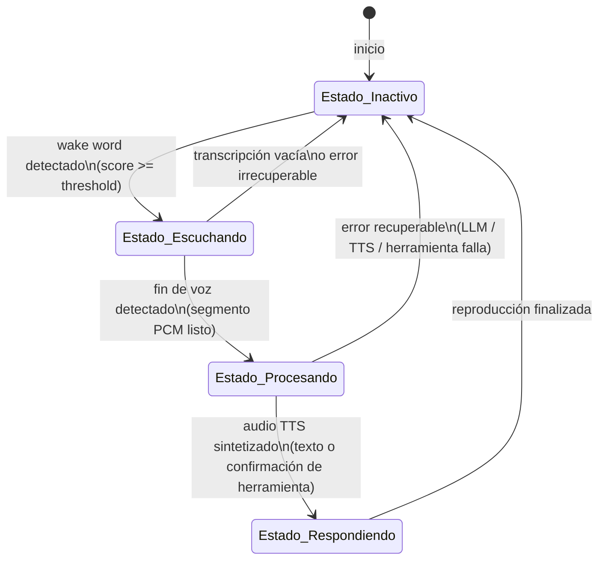
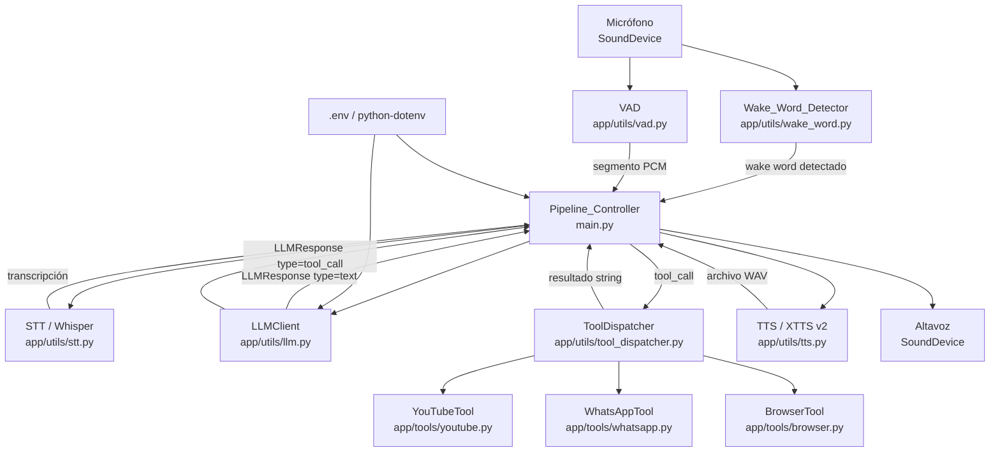

# Documento de Diseño: Voice Assistant Pipeline

## Overview

El sistema implementa un asistente de voz conversacional que responde al nombre "Jarvis". El flujo completo base es:

```
Estado_Inactivo → [wake word] → Estado_Escuchando → [fin de voz] →
Estado_Procesando (STT → LLM → TTS) → Estado_Respondiendo → Estado_Inactivo
```

Con el nuevo Sistema de Herramientas, el flujo se amplía en la etapa de procesamiento:

```
Estado_Procesando:
  STT → LLMClient
    ├── type="text"   → TTS → Estado_Respondiendo
    └── type="tool_call" → ToolDispatcher → ejecutar herramienta
              ├── éxito → TTS (confirmación) → Estado_Respondiendo
              └── error → TTS (descripción de error) → Estado_Respondiendo
```

El proyecto ya dispone de módulos operativos para VAD, STT, TTS y detección de wake word. Esta especificación cubre:

1. La creación del módulo `LLMClient` (`app/utils/llm.py`) con soporte de function calling.
2. La creación del `ToolDispatcher` (`app/utils/tool_dispatcher.py`).
3. La implementación de las herramientas: `YouTubeTool`, `WhatsAppTool` y `BrowserTool`.
4. La refactorización de `main.py` para orquestar el pipeline completo incluyendo herramientas.
5. La gestión de configuración mediante `.env` y `python-dotenv`.

Todo el código se escribe en **Python 3.10+**, siguiendo las convenciones ya establecidas en el proyecto. El sistema es compatible con **Linux (Ubuntu 22.04+)** y **Windows (Windows 10+)**. No se soporta Android ni sistemas móviles.

---

## Architecture

### Diagrama de estados del pipeline



### Diagrama de componentes



---

## Components and Interfaces

### `app/utils/llm.py` — LLMClient

Clase principal que encapsula toda la comunicación con OpenRouter. En su versión actualizada soporta function calling: retorna un `LLMResponse` que puede ser de tipo texto o de tipo tool_call.

```python
from dataclasses import dataclass
from typing import Literal, Any

@dataclass
class LLMResponse:
    type: Literal["text", "tool_call"]
    # Cuando type == "text":
    text: str | None = None
    # Cuando type == "tool_call":
    tool_name: str | None = None
    tool_args: dict[str, Any] | None = None


class LLMClient:
    def __init__(self):
        """
        Lee OPENROUTER_API_KEY y LLM_MODEL del entorno.
        Configura el cliente openai con base_url de OpenRouter.
        Registra las definiciones de herramientas disponibles.
        Lanza ValueError si OPENROUTER_API_KEY no está definida.
        """

    def generate(self, user_text: str) -> LLMResponse:
        """
        Envía user_text a OpenRouter junto con el mensaje de sistema
        y las definiciones de herramientas.
        Si la respuesta contiene un tool_call, retorna LLMResponse(type="tool_call", ...).
        Si la respuesta es texto, retorna LLMResponse(type="text", text=...).
        Propaga excepciones en caso de falla de la API.
        """
```

**Mensaje de sistema predefinido:**
```
Eres Jarvis, un asistente personal inteligente. Responde siempre en español,
de forma concisa y clara. Tus respuestas serán convertidas a voz, por lo que
debes evitar markdown, listas numeradas, viñetas, asteriscos y cualquier
carácter especial. Usa oraciones completas y naturales. Máximo 2-3 oraciones.
Cuando el usuario solicite reproducir música, video, enviar mensajes de
WhatsApp o buscar en internet, usa la herramienta correspondiente.
```

**Definiciones de herramientas (formato OpenAI function calling):**

```python
TOOL_DEFINITIONS = [
    {
        "type": "function",
        "function": {
            "name": "youtube",
            "description": "Reproduce música o video de YouTube, o controla la reproducción activa.",
            "parameters": {
                "type": "object",
                "properties": {
                    "action": {
                        "type": "string",
                        "enum": ["play_audio", "play_video", "pause", "resume", "stop"],
                        "description": "Acción a realizar"
                    },
                    "query": {
                        "type": "string",
                        "description": "Término de búsqueda en YouTube (requerido para play_audio y play_video)"
                    }
                },
                "required": ["action"]
            }
        }
    },
    {
        "type": "function",
        "function": {
            "name": "whatsapp",
            "description": "Lee mensajes no leídos de WhatsApp o envía un mensaje a un contacto.",
            "parameters": {
                "type": "object",
                "properties": {
                    "action": {
                        "type": "string",
                        "enum": ["read_unread", "send_message"],
                        "description": "Acción a realizar"
                    },
                    "contact": {
                        "type": "string",
                        "description": "Nombre o número del contacto (requerido para send_message)"
                    },
                    "message": {
                        "type": "string",
                        "description": "Texto del mensaje (requerido para send_message)"
                    }
                },
                "required": ["action"]
            }
        }
    },
    {
        "type": "function",
        "function": {
            "name": "browser",
            "description": "Abre el navegador para buscar en Google o abrir una URL específica.",
            "parameters": {
                "type": "object",
                "properties": {
                    "action": {
                        "type": "string",
                        "enum": ["search", "open_url"],
                        "description": "Acción a realizar"
                    },
                    "query": {
                        "type": "string",
                        "description": "Término de búsqueda (requerido para search)"
                    },
                    "url": {
                        "type": "string",
                        "description": "URL a abrir (requerido para open_url)"
                    }
                },
                "required": ["action"]
            }
        }
    }
]
```

### `app/utils/tool_dispatcher.py` — ToolDispatcher

Clase central que recibe el tool_call del LLMClient y delega la ejecución al módulo de herramienta correspondiente.

```python
class ToolDispatcher:
    def __init__(self):
        """
        Inicializa instancias de YouTubeTool, WhatsAppTool y BrowserTool.
        Construye un registro interno: dict[str, Callable] que mapea
        nombre de herramienta → método de ejecución.
        """

    def dispatch(self, tool_name: str, tool_args: dict) -> str:
        """
        Recibe el nombre de la herramienta y sus argumentos.
        Busca la herramienta en el registro interno.
        Si existe, llama al método de ejecución con tool_args como kwargs.
        Si no existe, retorna un mensaje indicando que la herramienta no está disponible.
        Captura cualquier excepción durante la ejecución y retorna un string de error descriptivo.
        Siempre retorna un string (nunca lanza excepción al llamador).
        """
```

### `app/tools/youtube.py` — YouTubeTool

```python
class YouTubeTool:
    def __init__(self):
        """
        Inicializa el estado interno de reproducción:
        self._player: instancia de vlc.MediaPlayer o None
        self._current_title: str con el título del contenido activo
        """

    def execute(self, action: str, query: str = "") -> str:
        """
        Punto de entrada principal. Despacha según action:
          "play_audio"  → _play_audio(query)
          "play_video"  → _play_video(query)
          "pause"       → _pause()
          "resume"      → _resume()
          "stop"        → _stop()
        Retorna string de confirmación o error.
        """

    def _play_audio(self, query: str) -> str:
        """
        Usa yt_dlp.YoutubeDL para buscar el primer resultado de 'ytsearch1:{query}'.
        Extrae la URL del stream de audio (formato de solo audio, mejor calidad).
        Crea un vlc.MediaPlayer con la URL del stream y llama a player.play().
        Guarda el título en self._current_title.
        """

    def _play_video(self, query: str) -> str:
        """
        Usa yt_dlp.YoutubeDL para buscar el primer resultado de 'ytsearch1:{query}'.
        Abre la URL de YouTube en el navegador con webbrowser.open().
        """

    def _pause(self) -> str: ...
    def _resume(self) -> str: ...
    def _stop(self) -> str: ...
```

**Dependencias:** `yt-dlp`, `python-vlc`

**Opciones de yt-dlp para extracción de stream de audio:**
```python
ydl_opts = {
    "format": "bestaudio/best",
    "quiet": True,
    "noplaylist": True,
    "extract_flat": False,
}
```

### `app/tools/whatsapp.py` — WhatsAppTool

```python
class WhatsAppTool:
    def execute(self, action: str, contact: str = "", message: str = "") -> str:
        """
        Despacha según action:
          "read_unread"   → _read_unread()
          "send_message"  → _send_message(contact, message)
        """

    def _read_unread(self) -> str:
        """
        Usa pywhatkit o selenium para acceder a WhatsApp Web (web.whatsapp.com).
        Lee los chats con mensajes no leídos y retorna un resumen en texto.
        """

    def _send_message(self, contact: str, message: str) -> str:
        """
        Usa pywhatkit.sendwhatmsg_instantly() o selenium para enviar el mensaje
        al contacto especificado.
        """
```

**Dependencias:** `pywhatkit` (implementación primaria), `selenium` (alternativa si pywhatkit no cubre lectura)

### `app/tools/browser.py` — BrowserTool

```python
import webbrowser
import urllib.parse

class BrowserTool:
    GOOGLE_SEARCH_URL = "https://www.google.com/search?q={}"

    def execute(self, action: str, query: str = "", url: str = "") -> str:
        """
        Despacha según action:
          "search"    → _search(query)
          "open_url"  → _open_url(url)
        """

    def _search(self, query: str) -> str:
        """
        Construye la URL de búsqueda de Google con urllib.parse.quote_plus(query).
        Abre en el navegador por defecto con webbrowser.open().
        """

    def _open_url(self, url: str) -> str:
        """
        Si url no comienza con "http://" ni "https://", añade "https://".
        Abre en el navegador por defecto con webbrowser.open().
        """
```

**Dependencias:** solo librería estándar de Python (`webbrowser`, `urllib.parse`)

### `main.py` — Pipeline_Controller (actualizado)

```python
def run_pipeline():
    """
    Carga configuración desde .env.
    Inicializa todos los módulos, incluyendo ToolDispatcher.
    Ejecuta el bucle principal de escucha de wake word.
    Gestiona transiciones de estado, herramientas y errores recuperables.
    """
```

**Lógica de ramificación post-LLM:**
```python
response = llm_client.generate(transcripcion)

if response.type == "text":
    texto_tts = response.text
elif response.type == "tool_call":
    texto_tts = tool_dispatcher.dispatch(response.tool_name, response.tool_args)
```

---

## Data Models

### Variables de entorno

| Variable | Tipo | Requerida | Valor por defecto | Descripción |
|---|---|---|---|---|
| `OPENROUTER_API_KEY` | `str` | Sí | — | Clave de API de OpenRouter |
| `LLM_MODEL` | `str` | No | `meta-llama/llama-3.1-8b-instruct:free` | Identificador de modelo en OpenRouter |
| `WAKE_WORD_THRESHOLD` | `float` | No | `0.5` | Umbral de confianza para activación |
| `TTS_SPEED` | `float` | No | `1.0` | Velocidad de síntesis de voz |

### LLMResponse (dataclass)

```python
@dataclass
class LLMResponse:
    type: Literal["text", "tool_call"]
    text: str | None = None         # Presente cuando type == "text"
    tool_name: str | None = None    # Presente cuando type == "tool_call"
    tool_args: dict | None = None   # Presente cuando type == "tool_call"
```

### Estructura de llamada a OpenRouter (con herramientas)

```python
messages = [
    {"role": "system", "content": SYSTEM_PROMPT},
    {"role": "user",   "content": user_text},
]
client.chat.completions.create(
    model=self.model,
    messages=messages,
    tools=TOOL_DEFINITIONS,
    tool_choice="auto",   # El LLM decide si usa herramienta o responde con texto
    max_tokens=300,
)
```

### Lógica de interpretación de la respuesta

```python
choice = response.choices[0]

if choice.finish_reason == "tool_calls" and choice.message.tool_calls:
    tool_call = choice.message.tool_calls[0]
    return LLMResponse(
        type="tool_call",
        tool_name=tool_call.function.name,
        tool_args=json.loads(tool_call.function.arguments),
    )
else:
    return LLMResponse(
        type="text",
        text=choice.message.content,
    )
```

### Estados del pipeline

```python
from enum import Enum

class PipelineState(Enum):
    INACTIVE    = "inactivo"
    LISTENING   = "escuchando"
    PROCESSING  = "procesando"
    RESPONDING  = "respondiendo"
```

### Frame de audio para wake word

openwakeword requiere frames de exactamente **1280 muestras** (int16) a **16000 Hz** (80 ms por frame).

---

## Correctness Properties

*Una propiedad es una característica o comportamiento que debe mantenerse en todas las ejecuciones válidas del sistema. Las propiedades sirven como puente entre las especificaciones legibles por humanos y las garantías de corrección verificables automáticamente.*

### Propiedad 1: El payload de la solicitud LLM incluye siempre el mensaje del usuario

*Para cualquier* cadena de texto de consulta no vacía, cuando `LLMClient.generate()` construye el payload de la solicitud, la lista de mensajes enviada a la API DEBE contener exactamente un mensaje con `role="user"` cuyo `content` sea igual al texto de consulta original.

**Valida: Requisitos 1.4**

### Propiedad 2: Extracción correcta del texto de respuesta del LLM

*Para cualquier* texto de respuesta generado por el modelo (cadena arbitraria de caracteres Unicode, incluyendo caracteres especiales, saltos de línea y espacios), cuando la respuesta no contiene `tool_calls`, `LLMClient.generate()` DEBE retornar un `LLMResponse` con `type="text"` y `text` igual al contenido sin modificación.

**Valida: Requisitos 1.7, 7.3**

### Propiedad 3: Transcripciones vacías o de solo espacios en blanco son descartadas

*Para cualquier* cadena compuesta únicamente de caracteres de espacio en blanco (espacio, tabulación, salto de línea, retorno de carro, o cualquier combinación de ellos), cuando el STT retorna dicha cadena como transcripción, el Pipeline_Controller DEBE descartar el segmento sin invocar a LLMClient ni a TTS, y regresar al Estado_Inactivo.

**Valida: Requisitos 4.9**

### Propiedad 4: El umbral de wake word separa correctamente activaciones de no-activaciones

*Para cualquier* puntuación de detección de wake word en el rango [0.0, 1.0] y *para cualquier* valor de umbral `WAKE_WORD_THRESHOLD` en el mismo rango, el Pipeline_Controller DEBE transicionar al Estado_Escuchando si y solo si la puntuación es mayor o igual al umbral.

**Valida: Requisitos 3.2**

### Propiedad 5: El ToolDispatcher siempre retorna un string

*Para cualquier* nombre de herramienta (incluidos nombres inválidos o desconocidos) y *para cualquier* diccionario de argumentos (incluidos argumentos vacíos, incompletos o de tipos incorrectos), `ToolDispatcher.dispatch()` DEBE retornar siempre un string no vacío, nunca lanzar una excepción al llamador.

**Valida: Requisitos 7.5, 7.6, 7.7**

### Propiedad 6: El LLMClient clasifica correctamente la respuesta según finish_reason

*Para cualquier* respuesta de la API donde `finish_reason == "tool_calls"` y `tool_calls` no está vacío, `LLMClient.generate()` DEBE retornar `LLMResponse(type="tool_call", ...)`. *Para cualquier* respuesta donde `finish_reason != "tool_calls"` o `tool_calls` está vacío/ausente, DEBE retornar `LLMResponse(type="text", ...)`.

**Valida: Requisitos 7.2, 7.3**

### Propiedad 7: El BrowserTool normaliza URLs sin esquema

*Para cualquier* string de URL que no comience con `"http://"` ni con `"https://"`, `BrowserTool._open_url()` DEBE abrir la URL con el prefijo `"https://"` añadido, nunca intentar abrir la URL desnuda.

**Valida: Requisitos 7.3.4**

---

## Compatibilidad Multiplataforma (Linux y Windows)

El sistema debe funcionar sin modificación de código fuente en ambas plataformas. La siguiente tabla resume los puntos de atención por componente:

| Componente | Linux | Windows | Notas de compatibilidad |
|---|---|---|---|
| `sounddevice` / PortAudio | ✅ | ✅ | En Windows, PortAudio se incluye en el wheel de sounddevice; en Linux puede requerir `libportaudio2` |
| `webrtcvad` | ✅ | ✅ | Wheels disponibles para ambas plataformas |
| `openai-whisper` + PyTorch | ✅ | ✅ | Requiere instalación de PyTorch antes de whisper |
| `TTS` (XTTS v2) + PyTorch | ✅ | ✅ | Requiere instalación de PyTorch antes de TTS |
| `openwakeword` (onnxruntime) | ✅ | ✅ | Wheels disponibles para ambas plataformas |
| `python-vlc` | ✅ | ✅ | **Requiere VLC instalado en el sistema** (no como paquete Python): en Linux `sudo apt install vlc`; en Windows instalar desde https://videolan.org |
| `pywhatkit` | ✅ | ✅ | Requiere WhatsApp Web autenticado en el navegador por defecto |
| `webbrowser` / `urllib` | ✅ | ✅ | Librería estándar, sin diferencias |
| `pathlib.Path` | ✅ | ✅ | Usar siempre en lugar de strings con `/` hardcodeado |

### Reglas de código para compatibilidad

1. **Rutas de archivo**: usar siempre `pathlib.Path` en lugar de strings con separadores hardcodeados.
   ```python
   # ❌ No hacer
   speaker_wav = "app/resources/audio.wav"
   # ✅ Hacer
   from pathlib import Path
   speaker_wav = Path("app") / "resources" / "audio.wav"
   ```

2. **Detección de VLC en YouTubeTool**: al inicializar `YouTubeTool`, intentar importar `vlc`; si falla, capturar el `ImportError` y marcar `self._vlc_available = False`. El método `_play_audio()` debe verificar `self._vlc_available` antes de intentar reproducir.

3. **Variable de entorno `TEMP`/`tmpdir`**: si se necesita un directorio temporal, usar `tempfile.gettempdir()` en lugar de `/tmp`.

### Dependencias del sistema (no-Python)

| Dependencia | Linux (Ubuntu/Debian) | Windows |
|---|---|---|
| VLC | `sudo apt install vlc` | Instalar desde https://videolan.org |
| PortAudio | `sudo apt install libportaudio2` (si sounddevice falla) | Incluido en wheel de sounddevice |
| Python 3.10+ | `sudo apt install python3.10` | Instalar desde https://python.org |

### Plataformas NO soportadas

- Android
- iOS
- macOS (no es objetivo, puede funcionar pero no está probado)
- Sistemas embebidos (Raspberry Pi, etc.)

---

## Error Handling

### Errores recuperables (no terminan el proceso)

| Origen | Tipo de excepción | Comportamiento |
|---|---|---|
| `LLMClient.generate()` | Cualquier excepción | Imprimir error, volver a Estado_Inactivo |
| `ToolDispatcher.dispatch()` | (capturado internamente) | Retornar string de error, continuar a TTS |
| `synthesize_text_to_file()` | Cualquier excepción | Imprimir error, volver a Estado_Inactivo |
| Reproducción de audio | Cualquier excepción | Imprimir error, volver a Estado_Inactivo |
| `YouTubeTool.execute()` | Cualquier excepción | ToolDispatcher retorna string de error |
| `WhatsAppTool.execute()` | Cualquier excepción | ToolDispatcher retorna string de error |
| `BrowserTool.execute()` | Cualquier excepción | ToolDispatcher retorna string de error |

### Errores irrecuperables (terminan el proceso)

| Origen | Condición | Comportamiento |
|---|---|---|
| `LLMClient.__init__()` | `OPENROUTER_API_KEY` ausente | Lanzar `ValueError` con mensaje descriptivo |
| Inicialización general | `KeyboardInterrupt` | Capturar, liberar recursos de audio, salir limpiamente |

### Patrón de manejo de errores en Pipeline_Controller

```python
try:
    llm_response = llm_client.generate(transcripcion)

    if llm_response.type == "text":
        texto_tts = llm_response.text
    else:
        texto_tts = tool_dispatcher.dispatch(
            llm_response.tool_name, llm_response.tool_args or {}
        )

    synthesize_text_to_file(texto_tts, ...)
    # reproducir audio...
except Exception as e:
    print(f"[Error recuperable] {type(e).__name__}: {e}")
finally:
    estado = PipelineState.INACTIVE
```

---

## Testing Strategy

### Evaluación de PBT

Los módulos `LLMClient` y `ToolDispatcher` contienen lógica de construcción de payloads, clasificación de respuestas y dispatch de herramientas que son **funciones con entradas y salidas bien definidas**, apropiadas para property-based testing.

`BrowserTool` tiene lógica de normalización de URL (añadir esquema) que es una función pura — candidata directa a PBT.

Las integraciones con VAD, Whisper, XTTS, OpenRouter, VLC y WhatsApp Web se cubren con pruebas de integración de ejemplo.

### Pruebas unitarias y de propiedad

**Framework:** `pytest` + `hypothesis` (property-based testing)

**Configuración mínima:** 100 iteraciones por prueba de propiedad.

**Etiquetado de pruebas de propiedad:**
```python
# Feature: voice-assistant-pipeline, Property {N}: {texto de la propiedad}
```

#### Módulo `llm.py`

| Prueba | Tipo | Propiedad / Criterio |
|---|---|---|
| `LLMClient` falla sin API key | Ejemplo | Requisito 1.8 |
| `LLMClient` usa default de modelo | Ejemplo | Requisito 1.2 |
| `LLMClient` configura base URL correcta | Ejemplo | Requisito 1.3 |
| `generate()` incluye siempre el texto del usuario en el payload | **Propiedad 1** | Requisito 1.4 |
| `generate()` extrae correctamente el texto cuando no hay tool_call | **Propiedad 2** | Requisitos 1.7, 7.3 |
| `generate()` retorna `LLMResponse(type="tool_call")` cuando hay tool_calls | **Propiedad 6** | Requisitos 7.2, 7.3 |
| `generate()` propaga excepciones de la API | Ejemplo | Requisito 1.9 |
| Las definiciones de herramientas se incluyen en el payload | Ejemplo | Requisito 7.1 |

#### Módulo `tool_dispatcher.py`

| Prueba | Tipo | Propiedad / Criterio |
|---|---|---|
| `dispatch()` retorna siempre un string para cualquier herramienta y args | **Propiedad 5** | Requisitos 7.5, 7.6, 7.7 |
| `dispatch()` retorna mensaje de herramienta no disponible para nombres desconocidos | Ejemplo | Requisito 7.7 |
| `dispatch()` captura excepción de herramienta y retorna string de error | Ejemplo | Requisito 7.6 |

#### Módulo `browser.py`

| Prueba | Tipo | Propiedad / Criterio |
|---|---|---|
| `_open_url()` añade "https://" a URLs sin esquema | **Propiedad 7** | Requisito 7.3.4 |
| `_search()` construye URL de Google correctamente | Ejemplo | Requisito 7.3.1 |

#### Módulo `main.py` (Pipeline_Controller)

| Prueba | Tipo | Propiedad / Criterio |
|---|---|---|
| Transcripción vacía descartada sin llamar a LLM | **Propiedad 3** | Requisito 4.9 |
| Umbral de wake word acepta/rechaza correctamente | **Propiedad 4** | Requisito 3.2 |
| Variables de entorno cargadas con defaults correctos | Ejemplo | Requisitos 2.2–2.5 |
| Pipeline termina limpiamente con KeyboardInterrupt | Ejemplo | Requisito 5.4 |
| Error de LLM no termina el proceso | Ejemplo | Requisito 5.1 |
| Respuesta tipo "text" va directamente a TTS | Ejemplo | Requisito 7.3 |
| Respuesta tipo "tool_call" pasa por ToolDispatcher antes de TTS | Ejemplo | Requisito 7.4 |

### Pruebas de integración

Las pruebas de integración se ejecutan con mocks de la API de OpenRouter, sounddevice, VLC y WhatsApp para evitar costes y dependencias externas.

| Prueba | Cobertura |
|---|---|
| Pipeline completo con respuesta de texto (mock de todos los módulos) | Requisitos 4.1–4.8 |
| Pipeline completo con tool_call de YouTube (mock) | Requisitos 7.1, 7.4, 7.5 |
| Pipeline completo con tool_call de WhatsApp (mock) | Requisitos 7.2, 7.4, 7.5 |
| Pipeline completo con tool_call de Browser (mock) | Requisitos 7.3, 7.4, 7.5 |
| Estado de retorno tras error recuperable en herramienta | Requisitos 5.1, 7.6 |
| Mensajes de consola en cada transición de estado | Requisitos 6.1–6.5 |

### No aplicable a PBT

Los siguientes requisitos no se benefician de property-based testing:
- **Requisitos 2.x** (configuración): son comprobaciones de valores fijos, no entradas variables.
- **Requisitos 4.x integración** (VAD, STT, TTS, audio): dependen de servicios externos y E/S de hardware.
- **Requisitos 6.x** (mensajes de consola): el comportamiento no varía con la entrada de formas que 100 iteraciones revelarían bugs adicionales.
- **Requisitos 7.1.x** (YouTubeTool ejecución real): depende de yt-dlp, VLC y conexión a internet.
- **Requisitos 7.2.x** (WhatsAppTool ejecución real): depende de WhatsApp Web y autenticación de sesión.
